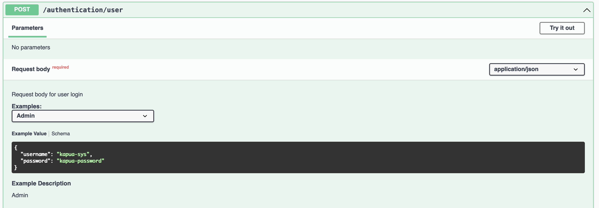
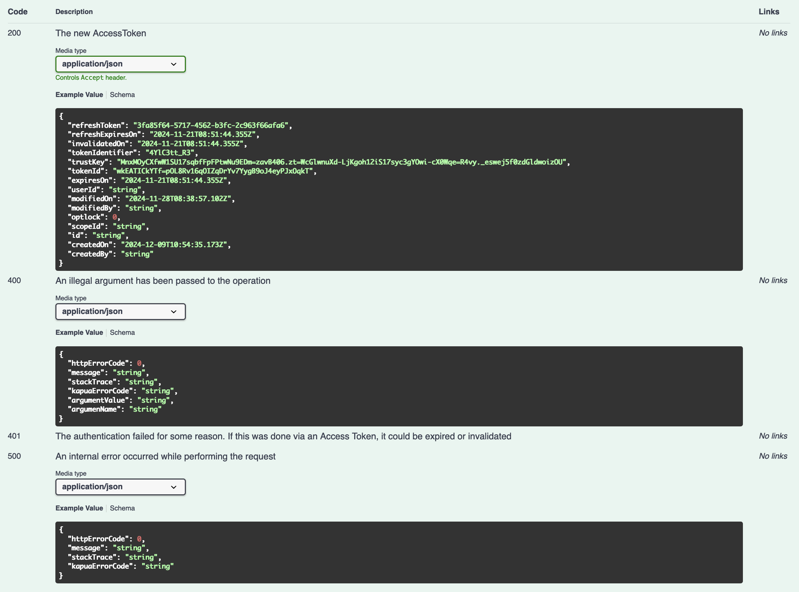

# Autogeneration Guide for OpenAPI

## Introduction

### Problem
Writing OpenAPI files manually has been a time-consuming and error-prone process. It requires meticulous effort to define endpoints, models, and configurations. This leads to inefficiencies, inconsistencies, and increases the chances of outdated or incorrect documentation.

#### Current Situation
Currently, the OpenAPI files in our Maven project are created and maintained manually. This approach:

1. Requires significant effort to keep documentation synchronized with code changes.
2. Increases the chances of discrepancies between the implemented APIs and their documentation.
3. Slows down the development process, especially when API changes are frequent.

#### What We Would Like
We aim to automate the generation of OpenAPI files directly from our codebase. This will help us:

1. Ensure API documentation is always up-to-date with the implementation.
2. Reduce manual effort and minimize the likelihood of errors.
3. Allow team members to focus on development rather than maintaining documentation.

#### Current Workflow
At present:
- **OpenAPI files** are stored in `kapua-rest-api-resources/resources`.
- **Java endpoint files** are located in `kapua-rest-api-resources/src`.

Whenever changes are made to a Java endpoint, developers must manually update the corresponding OpenAPI file. This process is error-prone and tedious, leading to potential misalignment between the implementation and documentation.


#### More Details on current workflow

At compilation time, within the `kapua-assembly-api` module, the OpenAPI files are copied from `kapua-rest-api-resources` to `kapua-assembly-api`. This is achieved using the following Maven plugin configuration:

```xml
<plugins>
    <plugin>
        <groupId>org.apache.maven.plugins</groupId>
        <artifactId>maven-dependency-plugin</artifactId>
        <executions>
            <execution>
                <id>Unpack Swagger UI</id>
                <phase>prepare-package</phase>
                <goals>
                    <goal>unpack</goal>
                </goals>
                <configuration>
                    <artifactItems>
                        <artifactItem>
                            <groupId>org.webjars</groupId>
                            <artifactId>swagger-ui</artifactId>
                            <version>${swagger-ui.version}</version>
                            <overWrite>true</overWrite>
                            <outputDirectory>${project.build.directory}/tmp/swagger-ui</outputDirectory>
                        </artifactItem>
                    </artifactItems>
                </configuration>
            </execution>
            <execution>
                <id>Unpack OpenAPI definitions</id>
                <phase>prepare-package</phase>
                <goals>
                    <goal>unpack</goal>
                </goals>
                <configuration>
                    <artifactItems>
                        <artifactItem>
                            <groupId>org.eclipse.kapua</groupId>
                            <artifactId>kapua-rest-api-resources</artifactId>
                            <version>${project.version}</version>
                            <overWrite>true</overWrite>
                            <outputDirectory>${project.build.directory}/tmp</outputDirectory>
                            <includes>openapi/**/*</includes>
                        </artifactItem>
                    </artifactItems>
                </configuration>
            </execution>
        </executions>
    </plugin>
</plugins>
```
Once the OpenAPI files are copied, they are merged together using the following plugin:
```xml
<plugins>
    <plugin>
        <groupId>org.codehaus.mojo</groupId>
        <artifactId>exec-maven-plugin</artifactId>
        <executions>
            <execution>
                <id>Bundle OpenAPI definitions</id>
                <phase>prepare-package</phase>
                <goals>
                    <goal>exec</goal>
                </goals>
                <configuration>
                    <executable>${swagger-cli.executable}</executable>
                    <arguments>
                        <argument>bundle</argument>
                        <argument>-t</argument>
                        <argument>yaml</argument>
                        <argument>-o</argument>
                        <argument>${project.build.directory}/tmp/openapi.yaml</argument>
                        <argument>${project.build.directory}/tmp/openapi/openapi.yaml</argument>
                    </arguments>
                </configuration>
            </execution>
        </executions>
    </plugin>
</plugins>
```
The result is a complete OpenAPI file (`${project.build.directory}/tmp/openapi/openapi.yaml`), which is then used by Swagger to generate the Swagger UI.

## New Workflow
In the new workflow:

- OpenAPI files will be **automatically generated** from the Java endpoint files.
- Java endpoints, being self-explanatory, will serve as the primary source for generating OpenAPI documentation.
- Developers will enhance the generated documentation by adding annotations where necessary (e.g., providing examples, descriptions, or additional metadata).

This approach will eliminate the need for manual synchronization between Java endpoints and OpenAPI files, ensuring consistency and saving time.

### How?
We will use the Swagger Maven Plugin to automate the generation of OpenAPI files during the Maven build process. Here is the plugin configuration added to the Maven pom.xml:
```xml
<build>
    <plugins>
        <plugin>
            <groupId>io.swagger.core.v3</groupId>
            <artifactId>swagger-maven-plugin</artifactId>
            <version>2.2.26</version>
            <configuration>
                <outputFileName>openapi</outputFileName>
                <outputPath>${project.build.directory}/openapi/</outputPath>
                <configurationFilePath>${project.basedir}/src/main/resources/conf.yaml</configurationFilePath>
                <outputFormat>YAML</outputFormat>
            </configuration>
            <executions>
                <execution>
                    <phase>compile</phase>
                    <goals>
                        <goal>resolve</goal>
                    </goals>
                </execution>
            </executions>
        </plugin>
    </plugins>
</build>
```
Configuration Breakdown
1.	`outputFileName`: Specifies the name of the generated OpenAPI file. Here, it will be named `openapi`.
2.	`outputPath`: Defines the directory where the OpenAPI file will be stored. In this case, it is `${project.build.directory}/openapi/`.
3.	`configurationFilePath`: Points to the YAML configuration file, which provides additional settings for the OpenAPI generation.
5.	`outputFormat`: Determines the file format (YAML in this case).

The configuration file (`rest-api/resources/src/main/resources/conf.yaml`) is as follows:
```yaml
prettyPrint: true
cacheTTL: 0
sortOutput: false
resourceClasses:
  - org.eclipse.kapua.app.api.resources.v1.resources.Authentication
  - org.eclipse.kapua.app.api.resources.v1.resources.Credentials
defaultResponseCode: 200
modelConverterClasses:
  - org.eclipse.kapua.app.api.resources.v1.resources.config.CustomConverter
openAPI: ...
```
Configuration Breakdown:
1. `prettyPrint`: Ensures the generated OpenAPI file is formatted for readability.
2. `cacheTTL`: Defines the cache time-to-live. A value of 0 disables caching.
3. `sortOutput`: Controls whether the output is sorted. false preserves the original order.
4. `resourceClasses`: Specifies the classes to scan for API definitions.

    _Note_: This will be removed once all classes are fully annotated for scanning.
5. `modelConverterClasses`: Specifies custom model converters.
   Further details about these converters will be provided in a following section.
6. `openAPI`: Matches part of the structure of the current base `openapi` file in use.

Benefits of this approach:
1.	Accuracy: The OpenAPI documentation will always reflect the actual implementation.
2.	Efficiency: Reduces time spent manually creating and updating OpenAPI files.
3.	Consistency: Ensures uniform documentation format across the project.

## Developer perspective
To understand how to annotate endpoint classes for automatic OpenAPI file generation, let's look at some snippets.

### Class annotations
The following code demonstrates the use of class annotations to control how classes are represented in OpenAPI documentation:
```java
@Path("/authentication")
@Tag(name = "Authentication", description = "Endpoints for managing authentication processes.")
@SecurityRequirements()
public class Authentication extends AbstractKapuaResource {
    ...
}
```
Here:
1. `@Tag(name = "Authentication", description = "Endpoints for managing authentication processes.")`:
    * Defines the name and description of the OpenAPI section for this endpoint.
    * This annotation will generate a section in the OpenAPI documentation under the specified name and description.
    * For example, in the Swagger UI, this corresponds to a clearly labeled section for "Authentication" endpoints (see the above Swagger screenshot).
2. `@SecurityRequirements()`:
    * Indicates the security requirements for the endpoint.
    * In the `conf.yaml` file, the default security is set to require an authentication token.
    * For cases where authentication is not required, such as the authentication endpoint itself, this annotation overrides the default behavior.
    * This ensures that endpoints without authentication requirements are documented correctly in the generated OpenAPI file.


### Method annotations
The following code demonstrates the use of method annotations to control how methods are represented in OpenAPI documentation:
```java
    @POST
    @Consumes({MediaType.APPLICATION_JSON, MediaType.APPLICATION_XML})
    @Produces({MediaType.APPLICATION_JSON, MediaType.APPLICATION_XML})
    @Path("user")
    @RequestBody(
        description = "Request body for user login",
        required = true,
        content = @Content(
            schema = @Schema(implementation = UsernamePasswordCredentials.class),
            examples = {
                @ExampleObject(
                    name = "Admin",
                    summary = "Admin",
                    value = "{ \"username\": \"kapua-sys\", \"password\": \"kapua-password\" }"
                ),
                @ExampleObject(
                    name = "MFA With Authentication Code",
                    description = "Example of login as a regular user",
                    value = "{\"username\": \"ec-sys\", \"password\": \"ec-password\", \"authenticationCode\": 123456, \"trustMe\": true }"
                ),
                @ExampleObject(
                    name = "MFA With TrustKey",
                    description = "Example of login as a regular user",
                    value = "{\"username\": \"ec-sys\", \"password\": \"ec-password\", \"trustKey\": \"1c34b3d4-ca23-11ec-9d64-0242ac120002\" }"
                )
            }
        )
    )
    @ApiResponses(value = {
        @ApiResponse(
            responseCode = "200",
            description = "The new AccessToken",
            content = @Content(schema = @Schema(implementation = AccessToken.class))
        ),
        @ApiResponse(
            responseCode = "400",
            description = "An illegal argument has been passed to the operation",
            content = @Content(schema = @Schema(implementation = IllegalArgumentExceptionInfo.class))
        ),
        @ApiResponse(
            responseCode = "401",
            description = "The authentication failed for some reason. If this was done via an Access Token, it could be expired or invalidated"
        ),
        @ApiResponse(
            responseCode = "500",
            description = "\t\n" + "\n" + "An internal error occurred while performing the request",
            content = @Content(schema = @Schema(implementation = ExceptionInfo.class))
        )
    })
    public AccessToken loginUsernamePassword(UsernamePasswordCredentials authenticationCredentials) throws KapuaException {
        return authenticationService.login(authenticationCredentials);
    }
```
Annotation Breakdown
1.	`@RequestBody`: Describes the structure and content of the request body. Attributes:
      * `description`: Provides details about the purpose of the request body.
      * `required`: Marks the request body as mandatory.
      * `content`: Specifies the schema and examples for the request body. Sub-components:
        * `schema`: Defines the structure of the request body, linking it to the `UsernamePasswordCredentials` class.
        * `examples`: Offers multiple examples to guide users on the expected input format.
2.	`@ApiResponses`: Specifies the possible HTTP responses for the endpoint. Attributes:
      * `responseCode`: HTTP status code for the response.
      * `description`: A brief explanation of the response.
      * `content`: Defines the schema of the response, linking it to a class.

These annotations will generate the following openapi code:
```yaml
/authentication/user:
    post:
      tags:
      - Authentication
      operationId: loginUsernamePassword
      requestBody:
        description: Request body for user login
        content:
          application/json:
            schema:
              $ref: '#/components/schemas/UsernamePasswordCredentials'
            examples:
              Admin:
                summary: Admin
                description: Admin
                value:
                  username: kapua-sys
                  password: kapua-password
              MFA With Authentication Code:
                description: Example of login as a regular user
                value:
                  username: ec-sys
                  password: ec-password
                  authenticationCode: 123456
                  trustMe: true
              MFA With TrustKey:
                description: Example of login as a regular user
                value:
                  username: ec-sys
                  password: ec-password
                  trustKey: 1c34b3d4-ca23-11ec-9d64-0242ac120002
          application/xml:
            schema:
              $ref: '#/components/schemas/UsernamePasswordCredentials'
            examples:
              Admin:
                summary: Admin
                description: Admin
                value:
                  username: kapua-sys
                  password: kapua-password
              MFA With Authentication Code:
                description: Example of login as a regular user
                value:
                  username: ec-sys
                  password: ec-password
                  authenticationCode: 123456
                  trustMe: true
              MFA With TrustKey:
                description: Example of login as a regular user
                value:
                  username: ec-sys
                  password: ec-password
                  trustKey: 1c34b3d4-ca23-11ec-9d64-0242ac120002
        required: true
      responses:
        "200":
          description: The new AccessToken
          content:
            application/json:
              schema:
                $ref: '#/components/schemas/AccessToken'
            application/xml:
              schema:
                $ref: '#/components/schemas/AccessToken'
        "400":
          description: An illegal argument has been passed to the operation
          content:
            application/json:
              schema:
                $ref: '#/components/schemas/IllegalArgumentExceptionInfo'
            application/xml:
              schema:
                $ref: '#/components/schemas/IllegalArgumentExceptionInfo'
        "401":
          description: "The authentication failed for some reason. If this was done\
            \ via an Access Token, it could be expired or invalidated"
        "500":
          description: "\t\n\nAn internal error occurred while performing the request"
          content:
            application/json:
              schema:
                $ref: '#/components/schemas/ExceptionInfo'
            application/xml:
              schema:
                $ref: '#/components/schemas/ExceptionInfo'
```
This YAML will render in Swagger as shown in these screenshots:



### Object annotations
From the previous example, you can see that objects like the `AccessToken` has example fields defined.
By default, if no explicit annotations are provided, the generated OpenAPI schemas include only the basic structure without custom examples or detailed descriptions.

For instance, without specific annotations, the generated OpenAPI YAML for the `AccessToken` would look like this:
```yaml
components:
  schemas:
    AccessToken:
      type: object
      properties:
        tokenId:
          type: string
        expiresOn:
          type: string
          format: date-time
        refreshToken:
          type: string
        refreshExpiresOn:
          type: string
          format: date-time
        invalidatedOn:
          type: string
          format: date-time
        trustKey:
          type: string
        tokenIdentifier:
          type: string
        userId:
          type: string
        modifiedOn:
          type: string
          description: Modified on date
          format: date-time
        modifiedBy:
          type: string
        optlock:
          type: integer
          description: Modified on date
          format: int32
        id:
          type: string
        scopeId:
          type: string
        createdOn:
          type: string
          format: date-time
        createdBy:
          type: string
```

Custom annotations provide the flexibility to add examples, detailed descriptions, and other metadata directly within the object definition. Below is a polished and simplified version (for clarity) of the `AccessToken` interface
```java
@Schema(
    name = "AccessToken",
    description = "Represents an authentication token with details such as expiry, refresh, and user information."
)
public interface AccessToken extends KapuaUpdatableEntity, Serializable {
    
    @Schema(description = "Unique identifier of the user associated with this token.",
        example = "wkEATICkYTf=pOL8Rv16qOIZqDrYv7YygB9oJ4eyPJxOqkT")
    String getTokenId();

    @Schema(description = "Unique identifier of the user associated with this token.", type = "string",
        example = "PSw45U3lS=1FtjJVux4XjG-8sYekK")
    KapuaId getUserId();

    @Schema(description = "The date and time when the token will expire.",
        example = "2024-11-21T08:51:44.355Z")
    Date getExpiresOn();

    @Schema(description = "The refresh token used to obtain a new access token.",
        example = "3fa85f64-5717-4562-b3fc-2c963f66afa6")
    String getRefreshToken();

    @Schema(description = "The date and time when the refresh token will expire.",
        example = "2024-11-21T08:51:44.355Z")
    Date getRefreshExpiresOn();

    @Schema(description = "The date and time when the token was invalidated, if applicable.",
        example = "2024-11-21T08:51:44.355Z", nullable = true)
    Date getInvalidatedOn();

    @Schema(description = "The trust key associated with this token, used for additional security.",
        example = "MnxMOyCXfwW1SU17sqbfFpFPtwNu9EDm=zavB406.zt=WcGlwnuXd-LjKgoh12iS17syc3gYOwi-cX0Wqe=R4vy._eswej5f0zdGldwoizOU")
    String getTrustKey();

    @Schema(description = "A unique identifier for the token.",
        example = "4YlC3tt_R3")
    String getTokenIdentifier();
}
```
With the improved annotations, the OpenAPI schema for `AccessToken` would look like this:
```yaml
components:
  schemas:
    AccessToken:
      type: object
      properties:
        refreshToken:
          type: string
          description: The refresh token used to obtain a new access token.
          example: 3fa85f64-5717-4562-b3fc-2c963f66afa6
        refreshExpiresOn:
          type: string
          description: The date and time when the refresh token will expire.
          format: date-time
          example: 2024-11-21T08:51:44.355Z
        invalidatedOn:
          type: string
          description: "The date and time when the token was invalidated, if applicable."
          format: date-time
          nullable: true
          example: 2024-11-21T08:51:44.355Z
        tokenIdentifier:
          type: string
          description: A unique identifier for the token.
          example: 4YlC3tt_R3
        trustKey:
          type: string
          description: "The trust key associated with this token, used for additional\
            \ security."
          example: MnxMOyCXfwW1SU17sqbfFpFPtwNu9EDm=zavB406.zt=WcGlwnuXd-LjKgoh12iS17syc3gYOwi-cX0Wqe=R4vy._eswej5f0zdGldwoizOU
        tokenId:
          type: string
          description: Unique identifier of the user associated with this token.
          example: wkEATICkYTf=pOL8Rv16qOIZqDrYv7YygB9oJ4eyPJxOqkT
        expiresOn:
          type: string
          description: The date and time when the token will expire.
          format: date-time
          example: 2024-11-21T08:51:44.355Z
        userId:
          type: string
        modifiedOn:
          type: string
          description: Modified on date
          format: date-time
          example: 2024-11-28T08:38:57.102Z
        modifiedBy:
          type: string
        optlock:
          type: integer
          description: Modified on date
          format: int32
          example: 0
        scopeId:
          type: string
        id:
          type: string
        createdOn:
          type: string
          format: date-time
        createdBy:
          type: string
      description: "Represents an authentication token with details such as expiry,\
        \ refresh, and user information."
```

### Parameter annotations
The following method demonstrates the use of parameter annotations to control how method parameters are represented in OpenAPI documentation:
```java
@GET
@Produces({MediaType.APPLICATION_JSON, MediaType.APPLICATION_XML})
public CredentialListResult simpleQuery(
        @PathParam("scopeId")
        @Parameter(schema = @Schema(type = "string"), description = "The scope ID to filter credentials.")
        ScopeId scopeId,
        @QueryParam("userId")
        @Parameter(schema = @Schema(type = "string"), description = "The user ID to filter credentials.")
        EntityId userId,
        @QueryParam("sortParam") String sortParam,
        @QueryParam("askTotalCount") boolean askTotalCount,
        @QueryParam("sortDir") @DefaultValue("ASCENDING") SortOrder sortDir,
        @QueryParam("offset") @DefaultValue("0") Integer offset,
        @QueryParam("limit") @DefaultValue("50") int limit) throws KapuaException {
    ...
}
```
This configuration generates the following OpenAPI YAML for the `simpleQuery` method:
```yaml
/{scopeId}/credentials:
  get:
    tags:
      - Credentials
    operationId: simpleQuery
    parameters:
      - name: scopeId
        in: path
        description: The scope ID to filter credentials.
        required: true
        schema:
          type: string
          example: _
      - name: userId
        in: query
        description: The user ID to filter credentials.
        schema:
          type: string
      - name: sortParam
        in: query
        schema:
          type: string
      - name: askTotalCount
        in: query
        schema:
          type: boolean
      - name: sortDir
        in: query
        schema:
          type: string
          default: ASCENDING
          enum:
            - ASCENDING
            - DESCENDING
      - name: offset
        in: query
        schema:
          type: integer
          format: int32
          default: 0
      - name: limit
        in: query
        schema:
          type: integer
          format: int32
          default: 50
    responses: ...
...
```
So notice that the `sortDir`, `offset`, and `limit` parameters are autogenerated with possible values and defaults, even without explicitly specifying them in the annotations.

However, this can be further improved by explicitly defining their behavior and purpose using annotations, as shown in the following example. This ensures the API documentation is more descriptive and user-friendly.
```java
@GET
@Produces({MediaType.APPLICATION_JSON, MediaType.APPLICATION_XML})
public CredentialListResult simpleQuery(
        @PathParam("scopeId")
        @Parameter(description = "The scope ID to filter credentials.", schema = @Schema(type = "string"))
        ScopeId scopeId,
        @QueryParam("userId")
        @Parameter(description = "The user ID to filter credentials.", schema = @Schema(type = "string"))
        EntityId userId,
        @QueryParam("sortParam")
        @Parameter(description = "The name of the parameter that will be used as a sorting key")
        String sortParam,
        @QueryParam("askTotalCount") boolean askTotalCount,
        @QueryParam("sortDir")
        @DefaultValue("ASCENDING")
        @Parameter(description = "If true, the total count of the entities matching the query will be included in the result set")
        SortOrder sortDir,
        @QueryParam("offset")
        @DefaultValue("0")
        @Parameter(description = "A Limit on the result size. The result set will not contain more items than this number")
        int offset,
        @QueryParam("limit")
        @DefaultValue("50")
        @Parameter(description = "An Offset on the result size. Used to skip the first `n` items of a result set, with `n` equal to the value of `offset`")
        int limit) throws KapuaException {
    ...
}
```
This will result in the following generated OpenAPI specification:
```yaml
  /{scopeId}/credentials:
    get:
      tags:
      - Credentials
      operationId: simpleQuery
      parameters:
      - name: scopeId
        in: path
        description: The scope ID to filter credentials.
        required: true
        schema:
          type: string
      - name: userId
        in: query
        description: The user ID to filter credentials.
        schema:
          type: string
      - name: sortParam
        in: query
        description: The name of the parameter that will be used as a sorting key
        schema:
          type: string
      - name: askTotalCount
        in: query
        schema:
          type: boolean
      - name: sortDir
        in: query
        description: "If true, the total count of the entities matching the query\
          \ will be included in the result set"
        schema:
          type: string
          description: "The sort direction. Can be ASCENDING (default), DESCENDING.\
            \ Case-insensitive (except for \"clientId\" parameter)."
          default: ASCENDING
          enum:
          - ASCENDING
          - DESCENDING
      - name: offset
        in: query
        description: A Limit on the result size. The result set will not contain more
          items than this number
        schema:
          type: integer
          format: int32
          default: 0
      - name: limit
        in: query
        description: "An Offset on the result size. Used to skip the first `n` items\
          \ of a result set, with `n` equal to the value of `offset`"
        schema:
          type: integer
          format: int32
          default: 50
      responses: ...
...
```

### Special cases
#### Handling KapuaId
Since we don't use dedicated DTOs for `KapuaId` objects (such as `ScopeId`, `EntityId`, etc.), these entities need special handling.
The issue is that while `KapuaId` is an object in the backend, it should be represented as a String from the API consumer’s perspective (e.g., in Swagger).

To treat `KapuaId` as a String in the API documentation, explicit annotations are required. For example, in the `Credential.java` file:
```java
@GET
@Produces({MediaType.APPLICATION_JSON, MediaType.APPLICATION_XML})
public CredentialListResult simpleQuery(
        @PathParam("scopeId")
        @Parameter(schema = @Schema(type = "string"), description = "The scope ID to filter credentials.")
        ScopeId scopeId,
        @QueryParam("userId")
        @Parameter(schema = @Schema(type = "string"), description = "The user ID to filter credentials.")
        EntityId userId,
        @QueryParam("sortParam") String sortParam,
        @QueryParam("askTotalCount") boolean askTotalCount,
        @QueryParam("sortDir") @DefaultValue("ASCENDING") SortOrder sortDir,
        @QueryParam("offset") @DefaultValue("0") Integer offset,
        @QueryParam("limit") @DefaultValue("50") int limit) throws KapuaException {
    ...
}
```
While this works, repeating the following annotation for every `KapuaId` object can be tedious and error-prone:
```java
@Parameter(schema = @Schema(type = "string"))
```
Attempting to add `@Schema(type = "string")` directly to the `ScopeId` class itself didn't work due to limitations in the library's default handling of model types.

To avoid redundant annotations and automate the mapping of `KapuaId` objects to String, a custom `ModelConverter` was implemented. A `ModelConverter` is used by the OpenAPI autogeneration library to customize how parameter types are parsed and represented in the OpenAPI file.

The CustomConverter is located at:
`rest-api/resources/src/main/java/org/eclipse/kapua/app/api/resources/v1/resources/config/CustomConverter.java`

Here's the implementation:
```java
public class CustomConverter implements ModelConverter {
    @Override
    public Schema resolve(AnnotatedType type, ModelConverterContext context, Iterator<ModelConverter> chain) {
        if (type.getType() instanceof SimpleType) {
            final SimpleType simpleType = (SimpleType) type.getType();

            // Treat KapuaId (and subclasses) as String in OpenAPI
            if (simpleType.isTypeOrSubTypeOf(KapuaId.class)) {
                Schema schema = new StringSchema();
                
                // Add specific example for ScopeId
                if (simpleType.isTypeOrSubTypeOf(ScopeId.class)) {
                    schema = schema.example("_");
                }
                return schema;
            }
        }

        // Delegate to the next converter in the chain
        if (chain.hasNext()) {
            return chain.next().resolve(type, context, chain);
        }

        return null; // No further processing
    }
}
```
By using this custom converter, any `KapuaId` or its subclasses (e.g., `ScopeId`, `EntityId`) are automatically treated as String in the OpenAPI documentation without needing repeated annotations.

## Guideline

### Use Interface-Based Annotations
When defining schema annotations, prefer applying them directly to the interface rather than the implementation class. This approach ensures the schema definitions are available universally and are not tied to a specific implementation.
For example:
```java
public interface UsernamePasswordCredentials extends LoginCredentials {

    @Schema(description = "The credential username.", example = "kapua-sys", defaultValue = "kapua-sys")
    String getUsername();

    @Schema(description = "The credential password.", example = "kapua-password", defaultValue = "kapua-password")
    String getPassword();

    @Schema(description = "Optional authentication code.", example = "123456", hidden = true)
    String getAuthenticationCode();

    @Schema(description = "Optional trust key.", example = "trust-key-abc", hidden = true)
    String getTrustKey();

    @Schema(description = "Indicates if the trust mechanism is enabled.", hidden = true, example = "false")
    boolean getTrustMe();
}
```
This is better than annotating the implementation class:
```java
public class UsernamePasswordCredentialsImpl implements UsernamePasswordCredentials, KapuaAuthenticationToken {
    @Schema(description = "The credential username.", example = "kapua-sys", defaultValue = "kapua-sys")
    private String username;
    @Schema(description = "The credential password.", example = "kapua-password", defaultValue = "kapua-password")
    private String password;
    @Schema(description = "Optional authentication code.", example = "123456", hidden = true)
    private String authenticationCode;
    @Schema(description = "Optional trust key.", example = "trust-key-abc", hidden = true)
    private String trustKey;
    @Schema(description = "Indicates if the trust mechanism is enabled.", hidden = true, example = "false")
    private boolean trustMe;
    ...
}
```
By annotating the interface, the OpenAPI documentation remains consistent and reusable across different implementations, while the implementation-specific details stay decoupled.